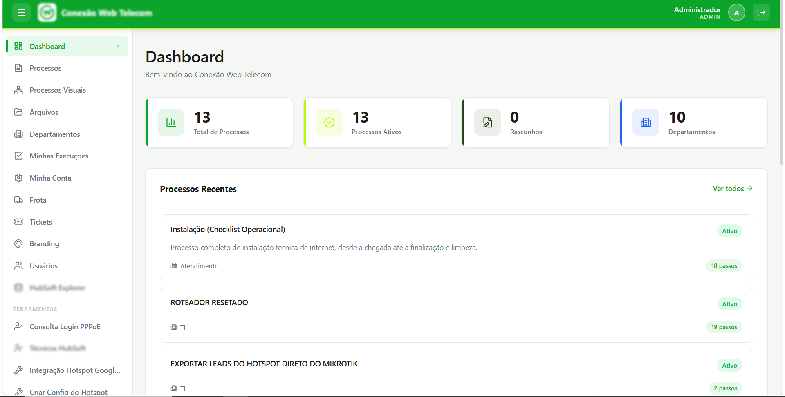
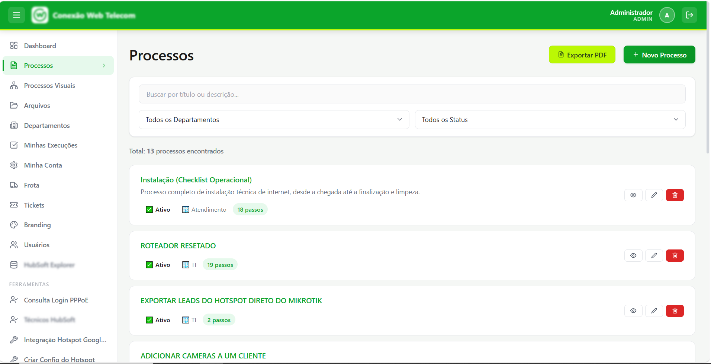
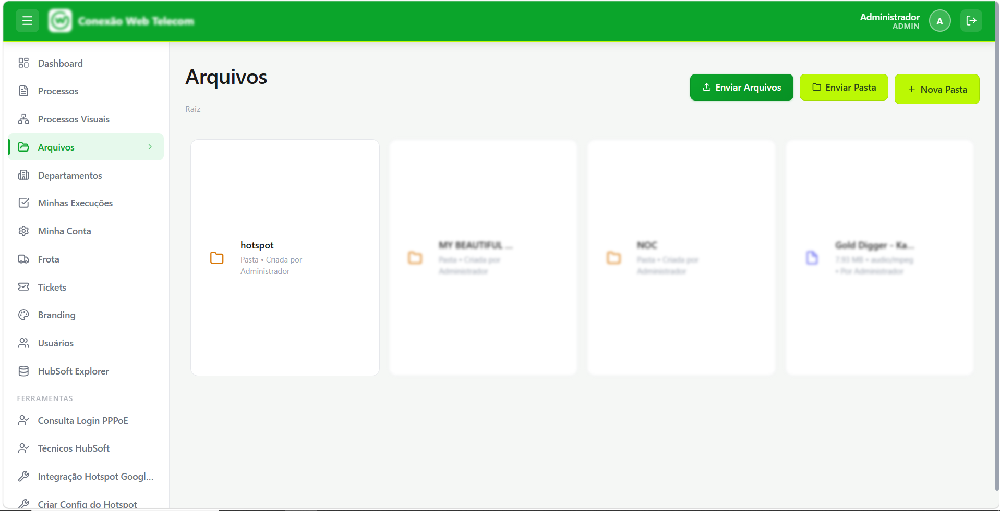
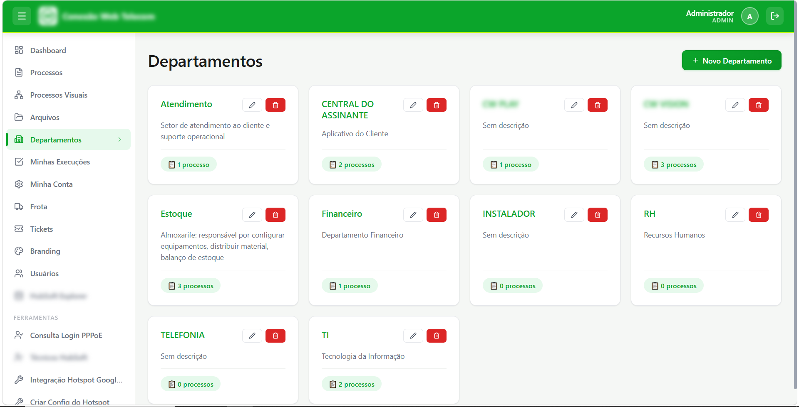
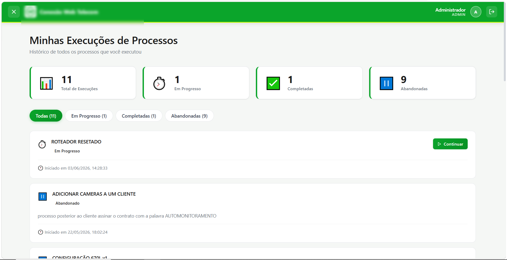
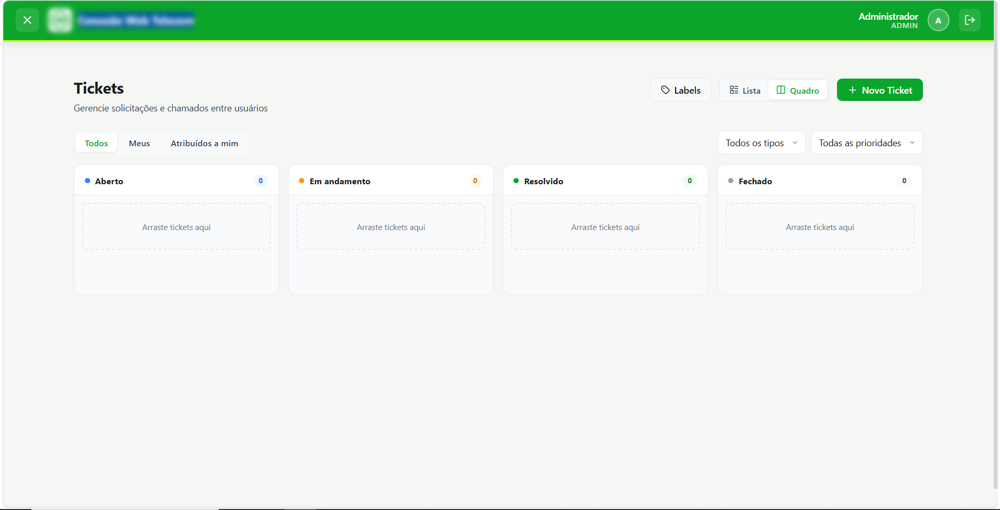
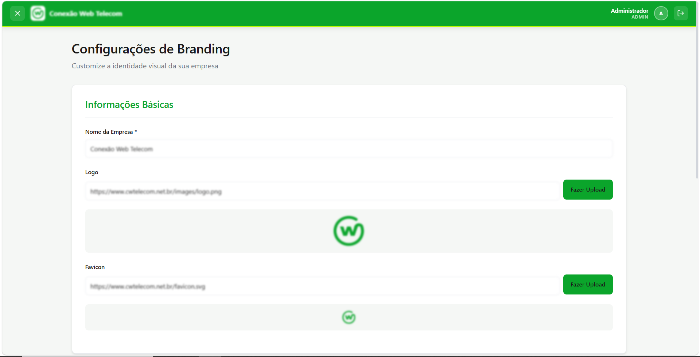
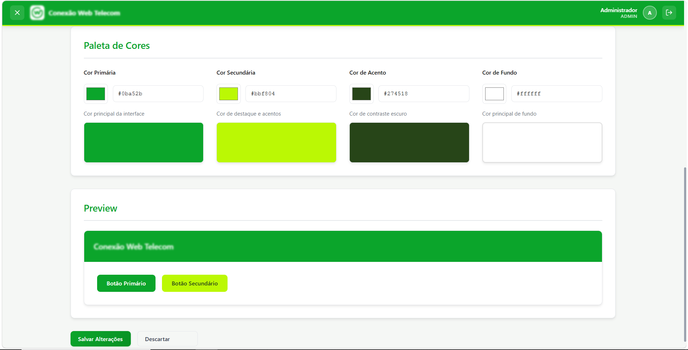

# Processos — Sistema de Gestão Operacional

Plataforma web para gestão de processos, execuções, arquivos, departamentos, chamados e frota. Desenvolvida com **Node.js + Express** no back-end e **React + Vite** no front-end.

---

## Telas

### Dashboard (`/dashboard`)
Visão geral do sistema: processos recentes, estatísticas de execuções e acesso rápido aos principais módulos.



---

### Processos (`/processos`)
Cadastro e gerenciamento de processos operacionais com etapas, departamento responsável e status. Suporta busca, filtros por departamento/status, paginação e exportação em PDF.



---

### Arquivos (`/arquivos`)
Repositório centralizado de arquivos vinculados a processos. Permite upload, visualização e download de documentos e anexos.



---

### Departamentos (`/departamentos`)
Gerenciamento dos departamentos da organização. Cada processo e usuário pode ser associado a um departamento.



---

### Execuções (`/execucoes`)
Acompanhamento de todas as execuções de processos: histórico, status, responsável e data. Permite filtrar execuções próprias ou de toda a equipe.



---

### Tickets (`/tickets`)
Sistema de chamados interno com suporte a tipos (Tarefa, Bug, História, Feature), prioridades (Baixa, Média, Alta, Urgente) e status (Aberto → Em andamento → Resolvido → Fechado). Visualização em lista ou kanban, comentários em tempo real e etiquetas coloridas. Chamados podem ser filtrados e atribuídos por departamento, com log de atividade registrando a troca de departamento.



---

### Indique e Ganhe (`/referral`)
Programa de indicação integrado ao HubSoft: clientes indicam novos contatos usando um portal público (`public-referral/`) sem necessidade de login. Cada indicação é validada contra a base de clientes/prospectos do HubSoft, e o desconto é aplicado automaticamente via webhook quando a indicação é ativada ou paga a primeira fatura — conforme a regra configurada (na ativação ou na primeira fatura paga) e o tipo de recompensa (desconto em valor ou remoção de fatura).


Portal público de indicação, usado pelos clientes sem necessidade de login:


---

### Leads (`/leads`)
Painel para acompanhar e gerenciar as indicações recebidas pelo programa Indique e Ganhe: status de cada lead, sincronização automática de pagamentos com o HubSoft e encaminhamento para os CRMs cadastrados.


---

### Dashboard de Manutenção (`/frota/manutencao-dashboard`)
Painel com layout customizável (drag-and-drop) mostrando custo total e quantidade de manutenções da frota por tipo, com filtro de período e gráficos de barras.


---

### Branding (`/branding`)

Personalização da identidade visual da plataforma, dividida em duas seções:

**Informações Básicas** — nome da empresa, logotipo e favicon.



**Paleta de Cores e Preview** — definição das cores primária, secundária e de destaque com prévia em tempo real da interface.



---

### Frota (`/frota`)
Gestão completa da frota de veículos com abas para:
- **Painel** — métricas e resumo da frota
- **Status** — situação atual de cada veículo
- **Veículos** — cadastro e detalhes dos carros
- **Motoristas** — gestão dos motoristas
- **Abastecimento** — registro de abastecimentos com leitura de QR Code em cupons fiscais
- **Manutenção** — histórico e agendamento de manutenções

---

## Executando localmente

```bash
# Instalar dependências
cd processo-audit-app/processo-audit-app
npm install
cd frontend && npm install

# Back-end
npm start

# Front-end (em outro terminal)
cd frontend && npm run dev
```

### Portal público de indicação (`public-referral/`)

App separado, sem autenticação, usado pelos clientes para indicar novos contatos e acompanhar suas indicações.

```bash
cd processo-audit-app/processo-audit-app/public-referral
npm install
npm run dev
```

---

## Tecnologias

| Camada | Stack |
|--------|-------|
| Front-end | React 18, Vite, React Router v6, CSS Modules, Axios |
| Back-end | Node.js, Express |
| Banco de dados | MySQL (mysql2) |
| Autenticação | JWT (jsonwebtoken), bcryptjs |
| Gráficos e dashboards | Chart.js / react-chartjs-2, React Grid Layout (dashboards com drag-and-drop) |
| Fluxogramas de processo | @xyflow/react |
| Documentos e exportação | jsPDF + jsPDF-AutoTable, Markdown (react-markdown + remark-gfm, marked) |
| Leitura de QR Code | html5-qrcode (cupons fiscais de abastecimento) |
| Web scraping / parsing | Cheerio (extração de dados de notas fiscais Sefaz) |
| Upload e arquivos | Multer, Archiver |
| Ícones | React Icons, Lucide React |
| PWA | vite-plugin-pwa |
| Testes | Playwright |
